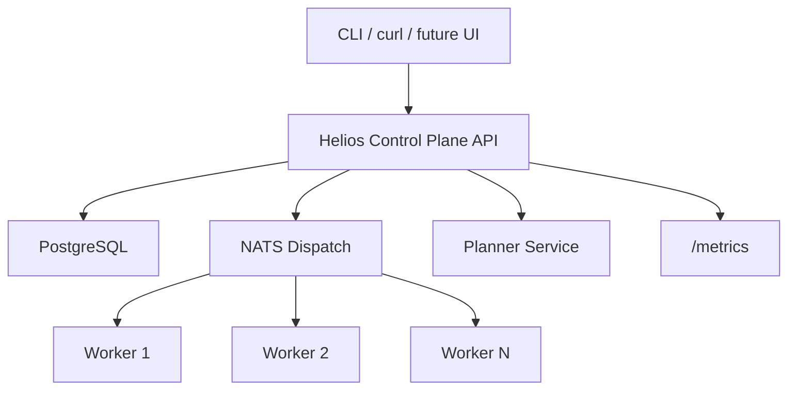
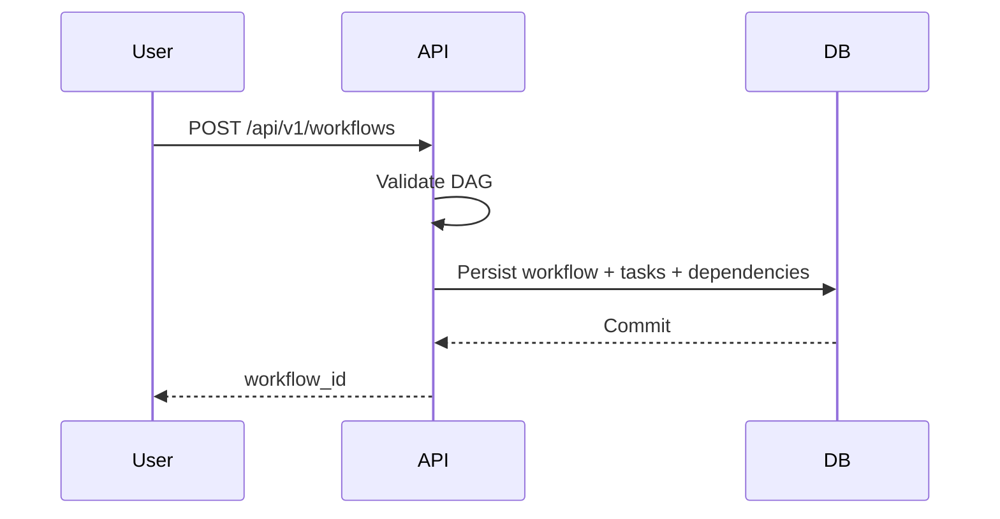
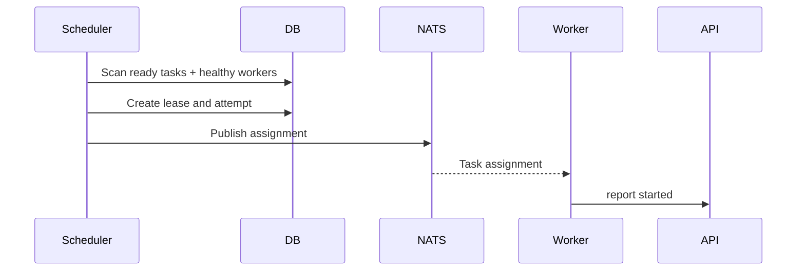
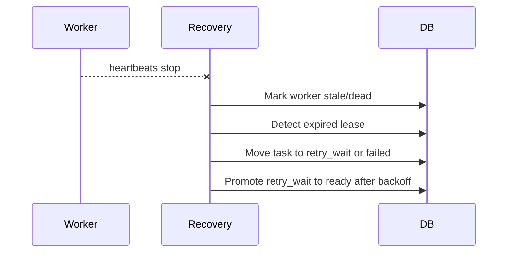
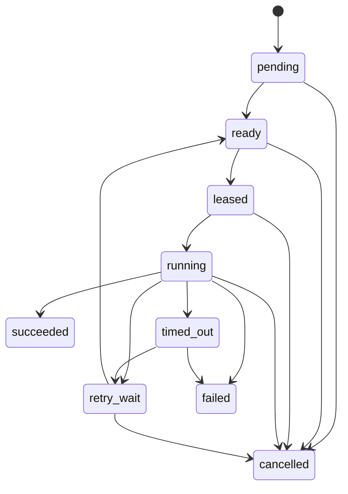

# Diagrams

## Architecture

```mermaid
flowchart TD
    UI["CLI / curl / future UI"] --> API["Helios Control Plane API"]
    API --> DB["PostgreSQL"]
    API --> NATS["NATS Dispatch"]
    API --> PLAN["Planner Service"]
    API --> METRICS["/metrics"]
    NATS --> W1["Worker 1"]
    NATS --> W2["Worker 2"]
    NATS --> WN["Worker N"]
```

## Workflow Submission Sequence

```mermaid
sequenceDiagram
    participant User
    participant API
    participant DB
    User->>API: POST /api/v1/workflows
    API->>API: Validate DAG
    API->>DB: Persist workflow + tasks + dependencies
    DB-->>API: Commit
    API-->>User: workflow_id
```

## Task Scheduling Sequence

```mermaid
sequenceDiagram
    participant Scheduler
    participant DB
    participant NATS
    participant Worker
    Scheduler->>DB: Scan ready tasks + healthy workers
    Scheduler->>DB: Create lease and attempt
    Scheduler->>NATS: Publish assignment
    NATS-->>Worker: Task assignment
    Worker->>API: report started
```

## Worker Failure Recovery Sequence

```mermaid
sequenceDiagram
    participant Worker
    participant Recovery
    participant DB
    Worker--xRecovery: heartbeats stop
    Recovery->>DB: Mark worker stale/dead
    Recovery->>DB: Detect expired lease
    Recovery->>DB: Move task to retry_wait or failed
    Recovery->>DB: Promote retry_wait to ready after backoff
```

## Task State Machine

```mermaid
stateDiagram-v2
    [*] --> pending
    pending --> ready
    ready --> leased
    leased --> running
    running --> succeeded
    running --> retry_wait
    running --> failed
    running --> timed_out
    retry_wait --> ready
    timed_out --> retry_wait
    timed_out --> failed
    pending --> cancelled
    ready --> cancelled
    leased --> cancelled
    running --> cancelled
    retry_wait --> cancelled
```
